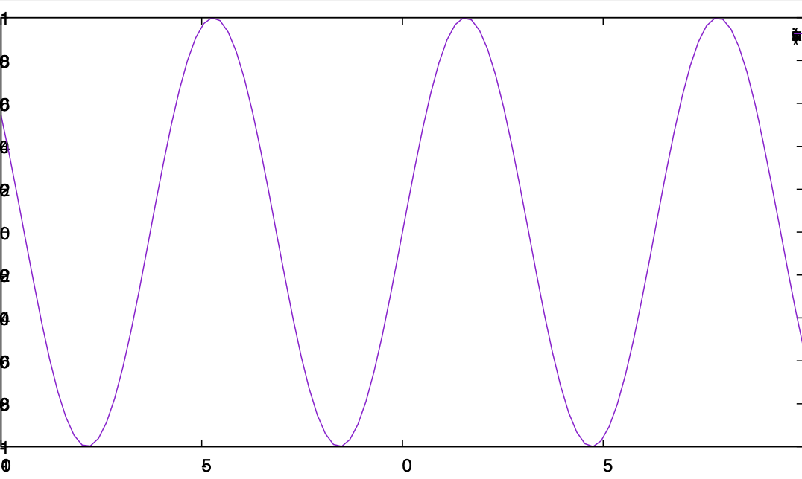
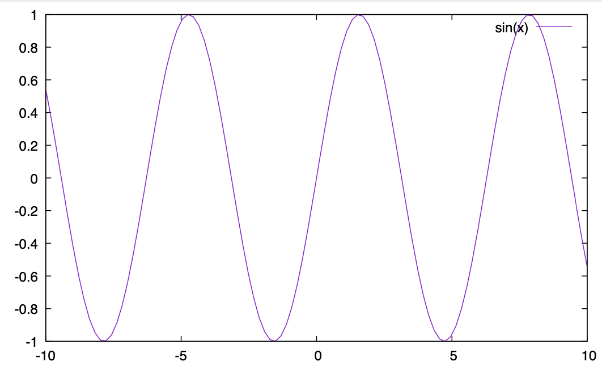

# ログ

[ログ一覧](index.html)

## [12月14日(月)](#14) <a id="14"></a>

重い腰をあげて英語メール書いたぞ。

Macのgnuplotでpdf表示がおかしくなる問題、Pangoが原因らしい。Cairoに由来するのでpngcairoもダメ。

まずバージョン確認。

```sh
$ brew info pango
pango: stable 1.46.1 (bottled), HEAD

$ gnuplot --versio
gnuplot 5.2 patchlevel 8

$ brew info gnuplot
gnuplot: stable 5.4.0 (bottled), HEAD
```

あれ？gnuplotのバージョンがおかしい。pango、1.46.1なら良さそうだけどな。この状態で、以下のgnuplotファイルを食わせる。

```gnuplot
set term pdf
set out "test.pdf"
p sin(x)
```

こうなっちゃう。



これはcairoが依存するpangoが原因なので、pngcairoもダメ。

さて、アンインストールして再インストール。

```sh
$ brew uninstall gnuplot
$ brew install gnuplot
(snip)
==> Pouring python@3.9-3.9.1.big_sur.bottle.tar.gz
Error: An unexpected error occurred during the `brew link` step
The formula built, but is not symlinked into /usr/local
Permission denied @ dir_s_mkdir - /usr/local/Frameworks
Error: Permission denied @ dir_s_mkdir - /usr/local/Frameworks
```

こけた。

```sh
$ brew doctor

Warning: Your Command Line Tools are too outdated.
Update them from Software Update in System Preferences or run:
  softwareupdate --all --install --force
```

古いそうだ。アップデートしろと言われるのでしてみる。

```sh
$ softwareupdate --all --install --force
Software Update Tool

Finding available software
No updates are available.
```

ダメだ。brew doctorは

```txt
If that doesn't show you an update run:
  sudo rm -rf /Library/Developer/CommandLineTools
  sudo xcode-select --install
```

と言ってるが、Xcodeの再インストールか・・・。するか。

```txt
sudo rm -rf /Library/Developer/CommandLineTools 
sudo xcode-select --instal
```

あらためてソフトウェアアップデート。

```sh
$ softwareupdate --all --install --force
Software Update Tool

Finding available software

Downloading Command Line Tools for Xcode
Downloaded Command Line Tools for Xcode
Installing Command Line Tools for Xcode
Done with Command Line Tools for Xcode
Done.
```

結構時間かかった。あらためてbrew doctor。

```sh
$ brew doctor
(snip)
Warning: You have unlinked kegs in your Cellar.
Leaving kegs unlinked can lead to build-trouble and cause brews that depend on
those kegs to fail to run properly once built. Run `brew link` on these:
  w3m
  docker
  libmpc@0.8
  pango
  isl@0.11
  mpfr@2
  gmp@4
  unbound
  gcc@4.9
  python@3.9
(snip)
Warning: Broken symlinks were found. Remove them with `brew cleanup`:
  /usr/local/bin/texdist
```

ほほう。まずは消そう。

```sh
brew cleanup
```

次はリンク。

```sh
$ brew link w3m docker libmpc@0.8 pango isl@0.11 mpfr@2 gmp@4 unbound gcc@4.9 python@3.9
Linking /usr/local/Cellar/w3m/0.5.3_6... 8 symlinks created
Linking /usr/local/Cellar/docker/18.09.6... 
Error: Could not symlink bin/docker
Target /usr/local/bin/docker
already exists. You may want to remove it:
  rm '/usr/local/bin/docker'

To force the link and overwrite all conflicting files:
  brew link --overwrite docker

To list all files that would be deleted:
  brew link --overwrite --dry-run docker
```

なんやねん。まずはこれを解決するか。

```txt
Warning: The following directories do not exist:
/usr/local/Frameworks
/usr/local/sbin

You should create these directories and change their ownership to your account.
  sudo mkdir -p /usr/local/Frameworks /usr/local/sbin
  sudo chown -R $(whoami) /usr/local/Frameworks /usr/local/sbin
```

```sh
sudo mkdir -p /usr/local/Frameworks /usr/local/sbin
sudo chown -R $(whoami) /usr/local/Frameworks /usr/local/sbin
```

あと、以下の問題を解決する。pangoやeigen3を手で入れたのが問題をおこしていた。

```txt
Warning: Unbrewed dylibs were found in /usr/local/lib.
Warning: Unbrewed header files were found in /usr/local/include.
```

brew doctorの指示に従ってこんな作業をする。

```sh
rm -rf /usr/local/include/pango-1.0 
sudo rm -rf /usr/local/include/pango-1.0  
rm /usr/local/lib/pkgconfig/pango.pc  
rm /usr/local/lib/pkgconfig/pangocairo.pc 
rm /usr/local/lib/pkgconfig/pangoft2.pc
brew install gdk-pixbuf librsvg
```

gdk-pixbuf librsvgのインストール、すごく時間かかる。なんか最初にこんなことを言われたのが気になる。

```txt
Error: homebrew-core is a shallow clone. To `brew update` first run:
  git -C "/usr/local/Homebrew/Library/Taps/homebrew/homebrew-core" fetch --unshallow
```

なんかbrew使うたびにこれを言われるので、やる。

```sh
git -C "/usr/local/Homebrew/Library/Taps/homebrew/homebrew-core" fetch --unshallow
```

あらためてインストール。

```sh
$ brew install gnuplot
Error: homebrew-cask is a shallow clone. To `brew update` first run:
  git -C "/usr/local/Homebrew/Library/Taps/homebrew/homebrew-cask" fetch --unshallow
```

homebrew-caskもかよ。

```sh
echo 'export PATH="/usr/local/opt/qt/bin:$PATH"' >> ~/.zshrc.mine 
```

いずれにせよ、ごちゃごちゃやってたらgnuplotが 5.4、pangoが1.48.0になった。もう一度試す。



おおー、治った。良かった。

## [12月13日(日)](#13) <a id="13"></a>

NOP

メール処理とかが遅れがちで厳しい。

## [12月12日(土)](#12) <a id="12"></a>

実験レポートの採点しなきゃ、と思ってたが、もう後期は終わっていた。

## [12月11日(金)](#11) <a id="11"></a>

自宅勤務。レポートの採点に手間取る。やはり家だといろいろ苦しい。ただし、大量のPDFを読んでいくのはWindowsの方が楽かもしれない。プレビューで見るとPDFからのコピペが正しくできない。VS Codeで大量に開く方法だと、少なくともWindowsでは大丈夫。Macでも試してみるか。

4時からKaggleもくもく会。今日はKaggleではなくGoogle Colab上で、講義で使った給与データを使っての解析。だいぶいろいろわかって来た気がする。今日の目的はLightGBMの「カテゴリ変数」の扱いをマスターすること。なんかうまく行かないと思ってたら、カテゴリ変数は整数型でなければならないことが判明。直したら上手くできた。来週はKaggleで試してみるかな。

## [12月10日(木)](#10) <a id="10"></a>

研究室ミーティング。発表は僕の番。「なぜ大きなプロジェクトは失敗するか」。

本読み輪講。田崎統計。今日は5.4-5.5。ショットキー比熱の「ショットキー」が人名であることをしばらく知らなかったのを思い出した。

## [12月9日(水)](#09) <a id="09"></a>

古いスマホを起動して、Google Authenticatorからアカウントの移行・・・をしようとしたらメニューにない。新しいスマホにはアカウントの移行があるのに。バージョンの違いかと思って古いスマホのGoogle Authenticatorをアップデートしたらメニューに現れた。そうだよな。最初からアカウントの移行があったらそれ使ってるだし、探したけど当時はなかったので。移動していなかった認証情報をQRコード一発で新スマホに移動。これ、怖いな。LastPassとかそういう認証が全部Google Authenticatorにかかってるので、スマホの認証情報を抜かれたら全てやられてしまう。

で、CMP-MLのブログとかTwitterをなんとかしようとしたが、メールサーバにつながらない。FWで弾かれているのか？とりあえず棚上げ。

IMAP-SSL(993)につながってるかをtelnetで確認して、つながらないことを確認。telnet使うのおっさんくさいと思うんだけど、最近では何使うんだろ？

年末調整の原本提出。A4に3枚になった。ホチキスで止めなくてよく、そのまま提出してよかった。

CMP-MLのブログとTwitter連携、なんとかしたはず。次にメールが流れてくるまでわからないけど。結構時間がかかってしまった。

注文したデスクライトが届いた。快適。

メールをたくさん書いた。

## [12月8日(火)](#08) <a id="08"></a>

なんか日記をつけ始めてから、やっぱり意識がはっきりする気がしてきたな。なんとなく流れていった日常が、ちゃんと意味を持つようになったというか。

学生さんの要望でディスプレイ買ったら、他にも使いたいという学生さんが出てきたのでType-CとHDMIをつなぐアダプタ購入。もともとプロジェクターにつなぐ用途しか考えてなかったので、一つしかいらないと思っていた。本当なら学生さんそれぞれに大きなディスプレイを買ってあげたい。

ネットで「アンチの生き方」みたいな記事をみた。なぜ、ある人はアンチになったかのドキュメンタリーのようなもの。ある人が書いた記事にたいして、ふとアンチなコメントを書いたら、他のアンチから褒められたらしい。これまで褒められることが少なかったその人は、その快感でどんどんアンチ活動を進めていくことになる。アンチ同士がお互いに褒め合うので、自分が間違っていることをしているとは思わなかったらしい。「その人はクズであり、酷評されてしかるべき人間であり、その人間がいるから自分は不幸なのだ、被害者なのだ」と。

やがて、自分を褒めてくれるアンチ仲間から見捨てられるのが怖くなり、なかば義務的にアンチ活動をするようになる。すると、「嫌い」であるにも関わらず、その人の一挙手一投足を観察しなければならなくなる。自分が嫌いだと思っている人が楽しそうにゲームをする、それだけで憂鬱になるという。

アンチ活動とは、ようする「自分の幸せの基準を他人に置く」ことにほかならない。「嫌なら見なければよいのに」と僕は思う。でも、わざわざ「自分にとって嫌な発言をする人の情報発信を細かくチェックする」人が多い。「間違いなく自分にとって嫌なことが書いてある」という予測が「当たる」ことによる報酬が快感になる、「自分が知らないところで嫌な情報が流れるのが嫌だ(部屋のどこかに蜂がいる)」、「自分が人を嫌うという(自分でもあまり良くないと感じている)感情を持っている時、その感情を正当化するための材料を探す」などいろいろな説がある。「自分にとって嫌だと思う情報がある可能性が高い」とわかっていて見に行ってしまう感情は僕にもわかる。僕は「はてブ」コメントは嫌いで、PCからは見られないようにしているが、たまにスマホで見に行ってしまう。「確かに自分にとって嫌なコメントがある」と確認したい感情なのだろう。

bashでgitのブランチ名を取得。まずはgit-promptをコピー

```sh
wget https://raw.githubusercontent.com/git/git/master/contrib/completion/git-prompt.sh
```

`.bashrc`に以下を追加。

```sh
source ~/git-prompt.sh
export PS1='[\u@\h \W$(__git_ps1 " (%s)")]\$ '
```

これでプロンプトにブランチ名が出る。bashでctrl+pで部分一致検索ができなくてzshを使ってたんだけど、普通にCtrl+Rで良いな。

あるマシンを使おうとしたらメンテ中。CMP-MLのブログ/Twitterをなんとかしようと重い腰を上げたが、物性研VPNのワンタイムパスワードが古いスマホ。なぜかリカバリコードが無効でログインできず。古いスマホを起動するしかない。なんかやろうと思ったことがことごとくできなくてストレス。

A64fxのアセンブリのお勉強。ld1dとかflmaみたいなSVE命令をググると極めて限られた人のブログしかひっかからない。

## [12月7日(月)](#07) <a id="07"></a>

部屋の暖房が入らない。指がかじかむ。

VMDを使ったアニメーションの作り方の説明書いた。なんかデフォルトでVideo Machというのを使うらしいのだが、どうも有料っぽい。とりあえず連番でファイルを吐かせてあとはFFmpegに突っ込む。楽ちん。

GitHubの認証がうまくいかずに苦しむ。どうも公開鍵でユーザを認識しているらしい。同じ鍵を使い回すと、先に見つけたユーザでアクセスしてしまう。「異なるユーザで同じ鍵」を想定していないんだろう。調べたらプライベートと仕事先で複数のアカウントがあると切り替えが面倒、みたいなことが書いてあった。

っていうか[この記事](https://techblog.zozo.com/entry/github_sso)によると、そもそもGitHubはマルチアカウントを想定していないっぽい。

僕のメインアカウントは有料アカウント(Pro)なので、もう一つ無料アカウントを持つのは規約違反ではないはず？プルリクやコラボレータの招待等の動作確認やスクショを取るのに、アカウントが2つ必要なんだよね・・・。

暖房の件、管財課にメールしたらすぐに対応してくれた。ありがたい。

明日のオフィス・アワーのために「線形代数というものの見方」のスライドを作った。

## [12月6日(日)](#06) <a id="06"></a>

NOP

また日付がグダグダに。ひどいもんだな。

```html
## [12月6日(日)](#06) <a id="06"></a>
```

毎回こんな書き方しているので、日付を書くところが三箇所もある。冗長だ。これをスクリプト噛ませてなんとかするのは簡単だが、そこまでするのもなぁ、という印象。

学生さんの卒論がGitHubで管理されており、僕がコラボレータになっているので進捗が見える。素晴らしい。

## [12月5日(土)](#05) <a id="05"></a>

NOP

## [12月4日(金)](#04) <a id="04"></a>

レポートの採点。毎週数時間かかる大仕事。

Kaggleもくもく会。今日も「House Prices: Advanced Regression Techniques」の続き。LogisticRegression、RandomForest、LightGBMの三種類を試しました。トレーニングデータを２つにわけてチェックしたところ、RandomForestは「完璧に」過学習していることが判明。パラメータを変えて過学習を防ぐと汎化性能も落ちてしまう。この三種類の中では、線形回帰がダメだめ、RandomForestがそれなり、LightGBMが最も性能が良かった。

## [12月3日(木)](#03) <a id="03"></a>

卒業アルバム撮影。研究室ミーティング。本読み輪講。今日は5.3の磁性体まわり。

物性研の来年度前期の申請出した。ChromeのPDF Viewerが悪さして、最後の確認がうまくできなかった。IT技術室に連絡。

学生さんがディスプレイ欲しいというので買った。EIZOのFlexscan。値段が手頃だったので。なんかWindowsとMacで黒の発色が違う気がする。色温度を指定している？

## [12月2日(水)](#02) <a id="02"></a>

何してたっけ？

思い出した。スライドを完成させてからプログラミング基礎同演習の最後の講義ビデオを録画してた。

あと、富岳でMDのベンチマークとった。48コア使ったらメモリ不足で落ちた。コアあたりのメモリが京より厳しい。

そのあとは某審査に参加。

## [12月1日(火)](#01) <a id="01"></a>

プログラミング基礎同演習のオフィス・アワー。アカギの「9(ナイン)」を題材にゲーム理論について話してみた。

「簡単な機械学習」のスライド修正。結構修正点がある。
