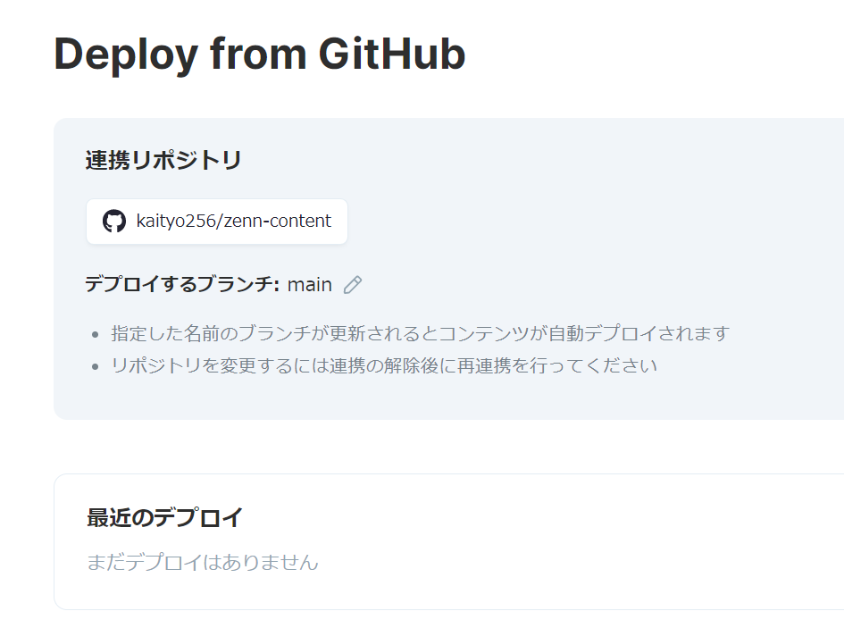

# ログ

[ログ一覧](index.html)

## [02月22日(月)](#22) <a id="22"></a>

[研究会](https://ccms.issp.u-tokyo.ac.jp/event/4228)のメモ。

原子間ポテンシャルの高精度モデリング
J. Behler and M. Parrinello
PRL 98 146401 (2007)

原子間力の非調和力定数の決定
熱伝導率
PRL 113, 185501 (2014)
PRB 92, 054301 (2015)
JPSJ 87, 
圧縮センシング (LASSO)を使うと、計算量が激減する。

実験データを再現するように結晶構造を決める。シミュレーティッドアニーリングでは遅いが、機械学習(ベイズ)では速い。

土師 将裕（東京大学 物性研究所）
圧縮センシングによる走査トンネル顕微鏡の高精度測定

y = A x
yが実空間 (観測量)
xが波数空間 (目的)
Aはフーリエ変換
yが欠けているときに、xを求めたい。

Y. Nakanishi-Ohno, MH, JPSJ 85, 093702 (2016)

田村 亮（東京大学大学院新領域創成科学研究科, 物質・材料研究機構）
ベイズ最適化と材料・物性研究への応用

ベイズ最適化をするアプリケーション
COMBO

ガスアトマイズ最適化
超合金粉末の最適化
R. Tamura, et al. Material & Design 198, 109290 (2020)

Liイオン伝導度最適化
K. Homma, et al. The Journal of Physical Chemistry C 124, 12865 (2020)

二元系
最高充填率
二次元二元系　9種類
三次元三元系　164種類

寺山 慧(横浜市立大学)
クライオEM密度マップからの生体分子ダイナミクス情報推定-データベース・シミュレーション・機械学習の融合

能動的な相図探索
Phys. Rev. Mater. 2019 JJAP 2019

Nature Machine Intelligence

Jackknifeの理解がおかしい。n個のデータを持つrに対して、まずbin_sizeで平均し、n/bin_sizeのデータを作ってから、それをJackknifeで一個外しては平均を取り、それに対してビンダー比を計算してもうまくいかない。詳しい人に聞いたらやっぱり間違っていた。まだ定義をきちんと理解できていない。

## [02月21日(日)](#21) <a id="21"></a>

NOP

## [02月20日(土)](#20) <a id="20"></a>

NOP

## [02月19日(金)](#19) <a id="19"></a>

あれ？昨日いろいろ仕事したのに日記書き忘れてたのか。

ミーティングとか。なんかオンラインになって逆に気軽にミーティングできるようになった感。

富岳で標準出力ファイルが大量に出る問題に対処。

## [02月18日(木)](#18) <a id="18"></a>

富岳にジョブを大量に投げた。プロセスとスレッド、「京」で起きた問題がまた起きてるな。

時間がなかなか取れない中、研究をすすめるためにいろいろ手を打つ。

## [02月17日(水)](#17) <a id="17"></a>

これで2日連続日付挿入スニペットを使ったぞ。

卒論の製本依頼した。表紙を別紙に用意したが、申込用紙の「表紙」にバツマークをつけて「マーク有」と書けば、ペンマークを入れてくれる。

研究室ミーティング。なるほど、面白い。

その後、B3のPCセットアップ。

Anacondaのインストール画面が違う。

pyenvでanacondaはM1にうまく入らなかったっぽい。

```sh
brew install pyenv
pyenv install 3.9.1
```

これでいけるはず。

また、lammpsをbrewで入れた時のパスが違う。

```sh
cd
mkdir lammps
cd lammps
cp -r /opt/homebrew/Cellar/lammps/2020-10-29/share/lammps/examples/melt .
cd melt
```

WSL2のインストールも書かないと。

## [02月16日(火)](#16) <a id="16"></a>

二週間くらいぶりに日付挿入スニペット使った。せめてこれからは毎日、このスニペットを使うことにしよう。っていうか、このスニペット使った回数を記録しておけば、日付通りに日記を書いた回数がわかるのか。

共著者の議論のために粘性を調べてて見つけた。

[撹拌講座『貴方の知らない撹拌の世界 ～よりよく混ぜて、よりよいプロセスに～』](https://www.shi-pe.shi.co.jp/technology/index.html#ancLec)

住友重機械プロセス機器株式会社による、相当「ガチ」な講座。すっごい詳しい。

共著者と議論した。僕もがんばらないと。

明日の準備。延長コード、ラベル屋さんシール、ヘッドセットなどを購入。

製本のやり方も聞いた。ペンマークも入れられるらしい。明日には入構したい。

学生さんのスライドも見た。製本の表紙は明日作ろう。

## [02月15日(月)](#15) <a id="15"></a>

引っ越しだなんだでバタバタしてたので、日記を書くのが一週間ぶり。結局日付挿入スニペット全く使ってないな。うーむ。

メール処理とか。

ずっと気になってた眼鏡のゆるみを直した。少しずつ日常を取り戻す。

重い仕事を一つ片づけたぞ。

Ubuntu 18.04ではpdftkがaptで入らないの、pdftkがGCJ(GNU Compile for Java)に依存しており、GCJがGCC 7.1から削除された影響らしい。Ubuntu 18.10ではpdftk-javaが用意され、20.04ではpdftkが復活してるとのこと。WSLのUbuntuをアップグレードするか悩む。

## [02月14日(日)](#14) <a id="14"></a>

NOP

J. P. ホーガンの「断絶への航海」について思うところをつらつら書いてみた。ユートピアとは何か。僕は学生さんには自分で考えて行動してほしいと思う。でも、自分で考えて行動する、という要求が厳しいことも知っている。

## [02月13日(土)](#13) <a id="13"></a>

NOP

わりと大きな地震。我々の家を含む、ごく狭い範囲だけ停電。2時間ほどで復旧。夜は冷えるのですぐに復旧してくれて助かった。

## [02月12日(金)](#12) <a id="12"></a>

仕事。

## [02月11日(木)](#11) <a id="11"></a>

荷ほどき。

## [02月10日(水)](#10) <a id="10"></a>

荷ほどき。

## [02月09日(火)](#9) <a id="09"></a>

引っ越し。

## [02月08日(月)](#8) <a id="08"></a>

修論発表会。みなさんがんばってました。お疲れ様でした。

## [02月07日(日)](#07) <a id="07"></a>

引っ越しの準備。段ボール詰めたりとか。

## [02月06日(土)](#06) <a id="06"></a>

引っ越しの準備。ケーブルテレビの工事。

## [02月05日(金)](#05) <a id="05"></a>

スニペットで上の日付が出てくる仕組み、「入力した日」が出てきちゃうので、後でまとめて書く時には結局修正しないといけないのだった(いまこれ土曜日に書いてる)。

なんかバタバタする。メール処理が追いつかない。

講義の成績登録した。みなさんよくがんばりました。

## [02月04日(Thu)](#04) <a id="04"></a>

いい加減ここの日付を書くのに手書きはアホ過ぎるのでスニペットを作ろう。まず、ローカル設定にしたいので、ローカルの.vscodeに作る。以下の内容で`.vscode/md.code-snippets`を作った。

```json
{
  "Print to console": {
    "scope": "markdown, md",
    "prefix": "date",
    "body": [
      "## [$CURRENT_MONTH月$CURRENT_DATE日($CURRENT_DAY_NAME_SHORT)](#$CURRENT_DATE) <a id=\"$CURRENT_DATE\"></a>",
      "$2"
    ],
    "description": "diary header"
  }
}
```

また、デフォルトではMarkdownでスニペット呼び出しができないので、`.vscode/settings.json`に以下を追加。

```json
{
  "[markdown]": {
    "editor.quickSuggestions": true
  },
}
```

これで「date(タブ)」と入力すると`## [02月04日(Thu)](#04) <a id="04"></a>`みたいな文字列が出てくるようになった。「木」ではなく「Thu」が出てしまったりするが、まぁ良いことにしよう。dateで出るのが鬱陶しくなったらprefix変えよう。

Macでなぜかnpmが動かない。

```sh
$ npm init --yes
dyld: Library not loaded: /usr/local/opt/icu4c/lib/libicui18n.64.dylib
  Referenced from: /usr/local/bin/node
  Reason: image not found
zsh: abort      npm init --yes
```

最近これ系(ダイナミックリンクライブラリがらみ)のエラー多いな。

```sh
$ brew install npm
(snip)
Error: node 12.9.1 is already installed
To upgrade to 15.8.0, run:
  brew upgrade node
```

ほほう。

```sh
$  brew upgrade node
==> Upgrading 1 outdated package:
node 12.9.1 -> 15.8.0
==> Upgrading node 12.9.1 -> 15.8.0 
==> Downloading https://homebrew.bintray.com/bottles/node-15.8.0.big_sur.bottle.
Already downloaded: /Users/watanabe/Library/Caches/Homebrew/downloads/9bf57615654f850ea19d76c53dee4b63bc00f11a242813b95b8450e45942a12b--node-15.8.0.big_sur.bottle.tar.gz
==> Pouring node-15.8.0.big_sur.bottle.tar.gz
🍺  /usr/local/Cellar/node/15.8.0: 3,336 files, 55.9MB
Removing: /usr/local/Cellar/node/12.9.1... (4,629 files, 53.4MB)
```

できたかな？

```sh
$ npm
(snip)
npm notice 
npm notice New patch version of npm available! 7.5.0 -> 7.5.2
npm notice Changelog: https://github.com/npm/cli/releases/tag/v7.5.2
npm notice Run npm install -g npm@7.5.2 to update!
npm notice 
```

ふむ。

```sh
npm install -g npm@7.5.2
```

もう一度。

```sh
npm install zenn-cli 
```

無事に通った。

```sh
$ npx zenn preview
👀Preview on http://localhost:8000
```

これで`http://localhost:8000`を見たらちゃんと見えた。よしよし。

ついでにhttpサーバの確認。

```sh
$ telnet localhost 8000
Trying ::1...
Connected to localhost.
Escape character is '^]'.
HEAD / HTTP/1.0

HTTP/1.1 200 OK
X-Powered-By: Next.js
ETag: "159e-WBZEF7rtwOl9mxryAKtsz2EiX+8"
Content-Type: text/html; charset=utf-8
Content-Length: 5534
Cache-Control: private, no-cache, no-store, max-age=0, must-revalidate
Vary: Accept-Encoding
Date: Thu, 04 Feb 2021 04:12:16 GMT
Connection: close

Connection closed by foreign host.
```

`Next.js`で動いているみたいですね。しかし、最近の若人はこういうの、何で調べてるんだろ？

WSL2でapt-get updateができない問題、日付がずれているのが原因だった。

```sh
date
2021年　1月 30日 土曜日 04:03:43 JST
```

なんでやねん。

```sh
sudo hwclock -s
```

で治った。これでnpmやzenn-cliを入れたところ、WLS2でnpx zenn previewが通った。全部WSL2の日付の問題であったらしい。

## [2月3日(水)](#3) <a id="03"></a>

卒論発表。昨日に引き続き、レベルの高い発表があって驚きました。とにかく無事に終わってよかったです。みなさんお疲れ様でした。

学生さん向けのWindows ノートPC届いたぞ、と。

もはやQiitaはダメっぽい。Zennを導入する。

* [GitHubとの連携](https://zenn.dev/zenn/articles/connect-to-github)



連携できたぞ。次にローカルでzenn-githubディレクトリを作って、[ここ](https://zenn.dev/zenn/articles/install-zenn-cli)を参考のテンプレートを作成した。また、ローカルにZenn連携リポジトリを作ったが、WSL2からプレビューがうまくいかない。DockerでNginxを立ち上げてブラウザから見るのはうまくいったので、なにか別の理由があるっぽいな。

研究室ミーティング。今日は中野さん。ようやくどんなことをしているかわかった気がするぞ。論文読んでもいまいち理解できていなかった。

特別講義のメールをたくさん出した。

## [2月2日(火)](#2) <a id="02"></a>

卒論発表。みなさん頑張ってて素晴らしいですね。

## [2月1日(月)](#1) <a id="01"></a>

2月になってしまった。いろいろ厳しい。

MacProが不安定。入力を受け付けなくなって強制再起動。どうもSlackが原因のような気がする。今回、Slackに入力しようとして固まったし、Windowsでもたまに動作がおかしいし。

輪講用の本が届いた。10冊。佐々さんの「熱力学入門」を読む。清水本と迷ったのだが、せっかくOBが来るし、薄いし。

重い腰を上げてtmuxを入れてみた。まだ使い方がよくわかっていない。

学生さんのWindows PC決めた。NECのLavieと迷ったが、ちょっと高かったのでEPSONのNA520Eに。値段的にちょうど良かったので。

GitHub演習のリポジトリを少し整理した。
