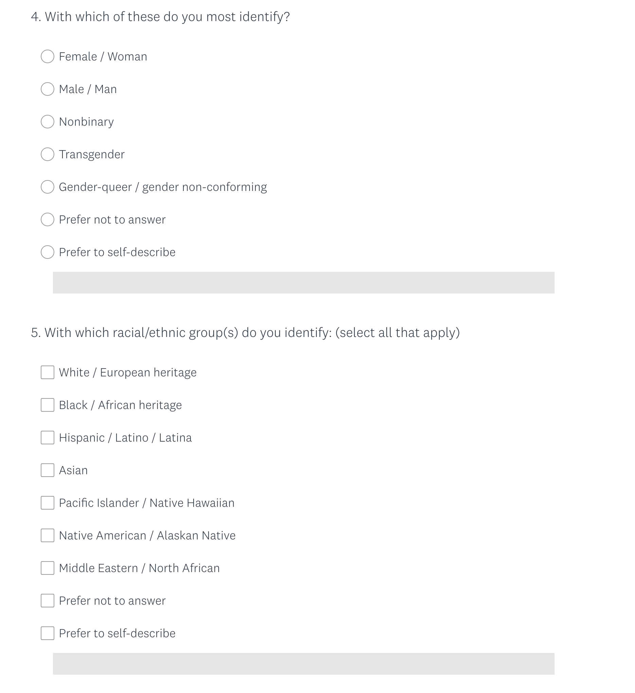

# ログ

[ログ一覧](index.html)

## TODO

* 若手奨励賞の申し込みを忘れない(二人分)
* [日本物理学会の申請](https://www.toyoag.co.jp/jps/) 5/18〜 6/3

## [06月02日(水)](#02) 

大事な用事をすっかり忘れていた。いかん。リマインドをいただいたので慌てて対応。カレンダーにちゃんと書いてあるのに見るのを忘れてたらしかたないよなぁ。

物理学会申し込んだぞ。追い込んでいくスタイル。

## [06月01日(火)](#01) 

5月があっさり終わっちゃったよ。

実験。その後しばらく放心してしまった。

大学院の時間割ぎめ。いろいろ把握しておらず、時間がかかる。もうちょっと楽な方法はないだろうか。

なんども話題にしているわりに毎回リンクを忘れるので。

[BOT業者の活動を“ほぼ壊滅”に追いやるまでの軌跡――「ドラゴンネスト」運営チームによる1年半の不正行為対策を振り返る](https://www.4gamer.net/games/043/G004358/20111216029/)

オンラインゲームでBOTによりRMTで儲けようとする業者と運営の戦い。

VMDのSurvey受けたけど、なんで性別聞かれるのん？さらにracial/ethnic group聞くのなんでだ？国だけでいいだろ。

Surveyには答えたが、「性別人種は聞かんでええやろ」とも伝えた。

ハンズオンの準備終わった。本当はローカルでテストするところまでやりたかったけど時間がなかった。

最近、SNSをやりすぎた気がする。明らかに依存気味。控えよう。
